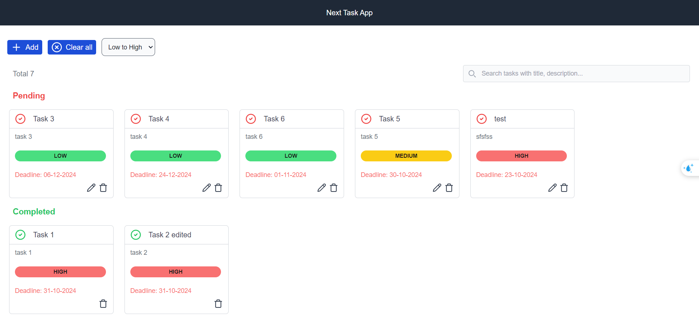

# Task Manager App in NextJS


**Task Features:**
- Add task: task have a title, description, and priority (high, medium, low).
- Edit task: Allows editing of the task title, description, and priority.
- Mark task as completed: Toggle between completed and pending states.
- Delete task: Remove tasks from the list.
- Sort tasks: Dynamically sort tasks by priority with high priority tasks at the top, 
- Use basic style with using Tailwind CSS for task list 
- Also added style for priorties (e.g., red for high, yellow for medium,
green for low).


**Sort Feature**

- Added sort by High to Low and Low to High
- The basic logic behind for High to Low sorting (more in details `sortTasks` in `src/store/useTask.ts`)
```bash
{
    HIGH: 1,
    MEDIUM: 2,
    LOW: 3
}
```

- And for Low to High

```bash
{
    HIGH: 3,
    MEDIUM: 2,
    LOW: 1
}

```
- Use select sorting order as `High to Low` or `Low to High` from select list and then it will sort the tasks


